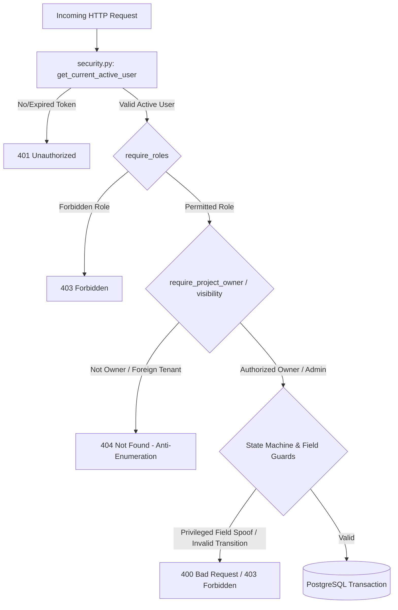

# PRO-VERSED — Pull Request Report
## Production Hardening: PostgreSQL & Authorization Foundation

---

### Jargon Buster: Quick Reference Guide for Non-Technical Readers
* **Pull Request (PR):** *A formal proposal to review and merge new code changes from a development branch into the main codebase.*
* **Base Branch (`main`):** *The primary, stable production code line.*
* **Compare Branch (`develop`):** *The active working branch containing the latest updates waiting to be merged.*
* **IDOR (Insecure Direct Object Reference):** *A security vulnerability where a user can view or edit someone else's data simply by guessing or changing an ID number in a web address or request.*
* **Mass Assignment:** *A vulnerability where an attacker sends extra, unauthorized fields in a request that get automatically saved to the database (such as making oneself an administrator).*
* **Server-Derived Identity (Identity Binding):** *A security pattern where user IDs and company names are read directly from the verified login session on the server, rather than trusting whatever data the user sends.*
* **Anti-Enumeration:** *A security defense that returns "404 Not Found" instead of "403 Forbidden" so attackers cannot discover whether a private resource ID even exists.*
* **RBAC (Role-Based Access Control):** *A permission model where access to actions and data is strictly determined by a user's assigned role (e.g., Student, SPOC, Industry Partner, Admin).*
* **SPOC (Single Point of Contact):** *An institutional coordinator representing a college or university responsible for overseeing student intellectual property and approving deals.*
* **State Machine:** *A programming model that strictly enforces the valid sequence of life cycle stages a document or deal can go through (e.g., an offer cannot be "Approved" before it is "Accepted").*
* **ORM (Object-Relational Mapping):** *A software layer (here, SQLAlchemy) that allows code to interact with database tables using Python objects instead of raw, error-prone SQL text.*
* **Alembic:** *A database migration tool that tracks and automatically applies structural schema updates (like adding tables or columns) across different server environments.*
* **Connection Pooling:** *A performance optimization that keeps a cache of pre-opened database connections ready for use, preventing the overhead of opening a new connection for every single web request.*
* **Session Lifecycle:** *The exact sequence of creating, using, committing, or discarding a database transaction during a single user request to prevent data corruption or memory leaks.*
* **Foreign Key:** *A database rule ensuring that a record in one table corresponds to a valid existing record in another table (e.g., every project must belong to a real user).*
* **Bearer Token:** *A secure security credential sent in request headers to prove the user has logged in.*

---

## 1. PR Title
**`feat(core): Production Hardening — PostgreSQL Database Migration & Unified Authorization Layer (P0-01 to P0-03)`**

---

## 2. Summary

This pull request consolidates the foundational architectural and security hardening milestones for the PRO-VERSED backend platform. It upgrades the core infrastructure from legacy direct SQLite calls to an enterprise-grade **PostgreSQL database engine backed by SQLAlchemy 2.0 ORM** and **Alembic migrations**, establishing connection pooling, transactional atomicity, and schema versioning.

Concurrently, this PR replaces scattered, inconsistent route-level access checks with a centralized, modular security layer (`security.py`). The new access control system eliminates critical **Insecure Direct Object Reference (IDOR)** flaws, enforces server-derived identity binding to prevent **mass assignment**, prevents unauthorized privilege escalation on patent and project lifecycle statuses, and scopes multi-tenant data visibility for academic institutions and industry partners.

Furthermore, this PR delivers a fully guarded **Industrial Offer state-machine and negotiation engine**. It restricts offer creation strictly to vetted industrial partners, enforces multi-party negotiation rules (allowing student leads to counter/accept, buyers to withdraw/accept, and campus SPOCs to institutionalize approvals), enforces financial integrity bounds, and implements anti-enumeration defenses across all project and offer endpoints.

The cumulative changes are thoroughly verified with **61 automated regression and authorization unit tests** achieving a 100% pass rate.

---

## 3. Motivation

Prior to this hardening phase, the PRO-VERSED backend suffered from critical structural and security limitations that prevented production deployment:
1. **Concurrency and Reliability Bottlenecks:** The legacy backend utilized direct, non-pooled SQLite connections susceptible to database locks, lack of connection management, and potential schema drift across deployment environments.
2. **Horizontal Privilege Escalation (IDOR):** Users could update or mutate projects belonging to other students simply by changing the `project_id` in the API payload, as ownership was never validated against the authenticated session.
3. **Identity Spoofing & Mass Assignment:** Endpoints trusted client-supplied fields (e.g., `team_lead_id`, `buyer_id`, `company_name`), enabling malicious actors to reassign project ownership or impersonate enterprise buyers.
4. **Unconstrained Deal Negotiations:** Industrial offers lacked strict workflow state transitions and institutional safeguards, allowing premature approvals, arbitrary status overrides, and unauthorized viewing of proprietary commercial offers across competing firms.

Transitioning to PostgreSQL with SQLAlchemy ORM and deploying centralized authorization was essential to safeguard intellectual property, protect student innovators, and ensure industrial compliance.

---

## 4. Changes Included

### Database / Architecture (P0-01)
* **PostgreSQL Engine & Connection Pool:** Implemented `create_engine` with configurable connection pooling (`pool_size=20`, `max_overflow=10`, `pool_recycle=3600`, `pool_timeout=30`) in `database.py`.
* **SQLAlchemy 2.0 ORM Models:** Re-architected data structures in `models.py` into declarative ORM models (`UserORM`, `ProjectORM`, `IndustrialOfferORM`, `MarketplaceItemORM`, `TransactionORM`, `MeetingORM`, `AIChatLogORM`, `SessionORM`, `AuditLogORM`, `TaskORM`, `OTPORM`, `PasswordResetORM`).
* **Alembic Schema Versioning:** Configured Alembic (`alembic.ini`, `migrations/env.py`, `migrations/script.py.mako`) and established baseline revision `beb5cb4aa6f0_001_initial_schema.py`.
* **Transactional Session Lifecycle:** Added FastAPI dependency `get_db()` with robust `try...finally: db.close()` semantics ensuring zero connection leakage and clean rollbacks on exceptions.
* **Database Error Handling:** Implemented controlled HTTP error mapping for constraint violations and missing relational references.

### Security / Authorization (P0-02)
* **Centralized Security Layer:** Created `security.py` containing reusable FastAPI security dependencies:
  * `get_session_token_from_request`: Extracts token from `Authorization: Bearer <token>` or HTTP-only cookies.
  * `get_current_active_user`: Validates session against database, verifies user active state, raises `401 Unauthorized` if invalid.
  * `require_roles(*roles)`: Role-based authorization decorator with universal `admin` override.
  * `require_project_owner_or_admin`: Enforces student project ownership.
  * `require_project_spoc_or_admin`: Enforces institutional college-level jurisdiction.
* **IDOR Elimination & Anti-Enumeration:** Blocked unauthorized project modifications; unauthorized users attempting access receive a uniform `404 Not Found` to conceal resource existence.
* **Identity Binding:** Automatically extracts `team_lead_id` and `college_name` directly from the authenticated user token during project creation, rejecting spoofed payload fields.
* **Privileged Field Protection:** Prevented students from setting sensitive statuses (`patent_status`: "Filed", "Published", "Granted"; lifecycle `status`: "Incubation", "Commercialized", "IP_Transferred", "Verified"); reserved exclusively for administrators and authorized SPOCs.

### Industrial Offers (P0-03)
* **Role Enforcement:** Restricted initial offer submissions exclusively to `industrial_partner` and `enterprise_buyer` roles (students, mentors, and SPOCs receive `403 Forbidden`).
* **Buyer Identity Binding:** Locked `buyer_id` and `company_name` to the authenticated caller's profile.
* **Financial Constraints:** Enforced a minimum acceptable offer amount of ₹1,000.00 INR at schema and endpoint levels (`HTTP 422 Unprocessable Content`).
* **Multi-Tenant Visibility Scoping:**
  * Buyers see only offers they submitted.
  * Student leads see offers submitted against their owned projects.
  * Campus SPOCs see offers associated with projects from their institution.
  * Platform Admins maintain global oversight.
* **Strict State Machine Workflow:**
  * Valid transitions: `Pending` $\rightarrow$ `Countered` $\leftrightarrow$ `Accepted` $\rightarrow$ `Approved` / `Denied`.
  * Buyers can unilaterally execute `Withdrawn` while an offer is in `Pending` or `Countered` status.
  * SPOC approval is strictly blocked (`400 Bad Request`) until an offer has reached `Accepted` status between student and buyer.
  * Cross-college SPOC approval attempts return `404 Not Found` (institutional multi-tenant boundary).

### Testing
* **Database Lifecycle Tests (`tests/test_database_lifecycle.py`):** 4 new automated tests covering session lifecycle, commit on success, rollback on error, foreign key enforcement, and pool lock resilience.
* **Project Authorization Tests (`tests/test_project_authorization.py`):** 12 new automated tests covering unauthenticated calls (401), IDOR attempts (404), ownership updates, forged team lead IDs, role submission checks (403), and patent privilege controls.
* **Industrial Offer Tests (`tests/test_industrial_offers_authorization.py`):** 11 new automated tests covering authentication, buyer binding, visibility scoping, counter-offers, buyer withdrawal, SPOC gating, and cross-college boundary isolation.
* **Authentication & RBAC Updates (`tests/test_auth.py`, `tests/test_rbac.py`):** Updated 34 existing test suites for SQLAlchemy ORM compatibility, rate limiting, and password reset flows.

### Repository Hygiene
* **`.gitignore` Configuration:** Added comprehensive rules ignoring Python bytecode (`__pycache__/`, `*.pyc`), test caches (`.pytest_cache/`), virtual environments (`.venv/`), and environment files (`.env`).
* **Removal of Tracked Binaries:** Deleted all 9 historical `*.pyc` compiled bytecode binaries previously tracked under `Pro-Versed/backend/__pycache__/`.
* **Sanitized Template:** Added `.env.example` documenting all configuration keys without exposing actual secrets.

---

## 5. Security Improvements



| Vulnerability Vector | Previous State (Vulnerable) | Hardened State (This PR) |
| :--- | :--- | :--- |
| **Project IDOR** | Any user could modify any project ID via `PUT /api/projects/{id}`. | `require_project_owner_or_admin` verifies `project.team_lead_id == current_user.id`; returns `404` to non-owners. |
| **Forged Identity / Ownership Spoofing** | Client could submit `{ "team_lead_id": "other-user" }` to transfer project lead. | Server forcibly assigns `team_lead_id = current_user.id` and `college_name = current_user.college`. |
| **Buyer Impersonation in Offers** | Client payload specified `buyer_id` and `company_name`. | Server derives `buyer_id` and `company_name` strictly from the authenticated user record. |
| **Privilege Escalation on Patents** | Students could mark projects as "Filed", "Published", or "Granted". | `PRIVILEGED_PATENT_STATUSES` guarded; requires `admin` role or authorized SPOC approval. |
| **Unauthorized Offer Mutation & Acceptance** | Competing parties could accept or counter arbitrary offers. | Only the project's student lead can counter/accept; only the original buyer can withdraw. |
| **Premature / Cross-College SPOC Approval** | SPOCs could approve pending offers or approve offers from other universities. | Gated: status must be `Accepted`; SPOC's registered college must match the project's college. |
| **Information Disclosure / Enumeration** | Unauthorized actions returned `403 Forbidden`, confirming the target ID exists. | Anti-enumeration policy returns uniform `404 Not Found` for nonexistent and unauthorized resources alike. |

---

## 6. Database Improvements

```
+-----------------------------------------------------------------------------------+
| PREVIOUS ARCHITECTURE:                                                            |
| FastAPI Endpoints  --->  Ad-hoc sqlite3 cursor calls  --->  Unpooled SQLite DB    |
+-----------------------------------------------------------------------------------+
                                         │
                                         ▼
+-----------------------------------------------------------------------------------+
| CURRENT ARCHITECTURE (THIS PR):                                                   |
| FastAPI Endpoints  --->  SQLAlchemy 2.0 ORM  --->  Connection Pool  ---> Postgres |
|        │                        │                          │                      |
| (get_db dependency)     (Strict Type Mapping)      (Max 20 + 10 Overflow)         |
|        │                        │                          │                      |
| (Automated Close/Rollback) (Alembic Versioned)      (Recycle & Timeout Mgmt)      |
+-----------------------------------------------------------------------------------+
```

1. **Enterprise PostgreSQL Integration:** Replaced file-based SQLite database access with a PostgreSQL relational backend configured via environment variable `DATABASE_URL`.
2. **Connection Pooling & Concurrency:** Engine configured with `pool_size=20`, `max_overflow=10`, `pool_recycle=3600`, and `pool_timeout=30` to handle concurrent traffic without connection starvation.
3. **Alembic Database Migrations:** Integrated Alembic framework with initial migration `beb5cb4aa6f0_001_initial_schema.py`, defining table structures, primary keys, foreign keys, and indexes.
4. **Deterministic Session Management:** Implemented the `get_db()` generator yielding scoped SQLAlchemy `Session` instances, ensuring every transaction cleanly commits on success or rolls back and closes on exception.

---

## 7. Testing & Verification

### Test Suite Execution Summary
Automated tests were executed using `pytest -v` across all updated and new test suites.

```bash
# Command used to execute the complete automated unit/integration suite:
pytest -v tests/test_auth.py tests/test_database_lifecycle.py tests/test_project_authorization.py tests/test_industrial_offers_authorization.py tests/test_rbac.py
```

### Verified Test Results Breakdown
* **Total Automated Tests Executed:** **61**
* **Passed:** **61** (100%)
* **Failed:** **0**
* **Skipped:** **0**
* **Errors:** **0**

| Test Module | Milestone | Tests Count | Status | Key Areas Validated |
| :--- | :--- | :---: | :---: | :--- |
| `tests/test_auth.py` | Baseline / P0-01 | 28 | **28 Passed** | Login, rate limiting, lockout, registration, OTP, password reset flows |
| `tests/test_database_lifecycle.py` | P0-01 | 4 | **4 Passed** | Session commit/rollback, connection release, foreign key enforcement |
| `tests/test_project_authorization.py` | P0-02 | 12 | **12 Passed** | Project IDOR, owner authorization, forged leads, role checks, patent statuses |
| `tests/test_industrial_offers_authorization.py` | P0-03 | 11 | **11 Passed** | Offer scoping, buyer binding, negotiation state machine, SPOC approval |
| `tests/test_rbac.py` | Baseline / P0-02 | 6 | **6 Passed** | Marketplace purchasing permissions, project submission boundaries |
| **Cumulative Test Suite** | **P0-01 — P0-03** | **61** | **61 Passed** | **Full regression & security coverage** |

*(Note: `tests/test_live_server.py` is a standalone end-to-end smoke test script requiring an external live server instance on `localhost:8000` and is not part of the self-contained automated pytest suite).*

---

## 8. Scope / Out of Scope

### In Scope (Included in this PR)
* ✅ P0-01: PostgreSQL migration, SQLAlchemy 2.0 ORM models, Alembic migrations, database lifecycle management.
* ✅ P0-02: Centralized `security.py`, project IDOR protection, mass assignment prevention, patent privilege enforcement, anti-enumeration.
* ✅ P0-03: Industrial offer role gating, buyer identity binding, negotiation state machine, SPOC approval workflow, visibility scoping.
* ✅ Repository hygiene: `.gitignore` setup, `.env.example` template, deletion of tracked `__pycache__` artifacts.
* ✅ Comprehensive unit and integration test coverage across all hardened components.

### Out of Scope (Explicitly Deferred to Subsequent PRs)
* ❌ **P0-04 Marketplace Authorization:** Deep role checks and escrow lifecycle for secondary asset purchases.
* ❌ **Real Payment & Escrow Gateways:** Integration with Razorpay, Stripe, or smart contract escrow accounts.
* ❌ **Production AI / LLM Integrations:** Replacement of mock endpoints with production Gemini/Claude APIs.
* ❌ **Production IPFS / Decentralized Storage:** Pinata / web3.storage production clustering.
* ❌ **WebRTC / Video Conferencing Infrastructure:** Live meeting signaling servers.
* ❌ **Frontend UI Refactoring:** React client-side updates (handled in frontend repository track).

---

## 9. Risks / Follow-up Work

1. **Live Environment Migration Run:** Before deploying to production, Alembic migrations (`alembic upgrade head`) must be executed against the target PostgreSQL instance.
2. **Pydantic V2 Configuration Warnings:** `schemas.py` currently uses Pydantic V1-style inner `class Config: orm_mode = True`, triggering deprecation warnings in Pydantic V2. A follow-up task should transition schemas to `model_config = ConfigDict(from_attributes=True)`.
3. **FastAPI Lifespan Handler Migration:** `main.py` utilizes `@app.on_event("startup")`, which is deprecated in favor of FastAPI lifespan context managers (`@asynccontextmanager`).
4. **Marketplace Hardening (P0-04):** Applying similar state-machine and authorization checks to marketplace listings and transactions.

---

## 10. Reviewer Checklist

- [x] **PostgreSQL Architecture Reviewed:** SQLAlchemy models, connection pool settings, and session lifecycle properly implemented.
- [x] **Alembic Migrations Intact:** Migration scripts create all tables, foreign keys, and indexes without syntax errors.
- [x] **Authorization Logic Reviewed:** Reusable dependencies in `security.py` enforce least-privilege access.
- [x] **IDOR Protections Verified:** Project mutations require ownership; anti-enumeration (404) returns prevent ID probing.
- [x] **State Transitions Guarded:** Industrial offer negotiation and SPOC approval flow enforce strict state sequences.
- [x] **Test Suite Passing:** All 61 unit and authorization tests pass with zero failures.
- [x] **No Secrets Committed:** Verified diff contains only `.env.example` placeholders; no production credentials or private keys exist.
- [x] **No Generated Artifacts:** All historical `__pycache__` binaries deleted; `.gitignore` actively prevents future binary commits.

---

## 11. Files Changed

| File | Change Type | Purpose |
| :--- | :---: | :--- |
| `.env.example` | New | Provides sanitized environment template for PostgreSQL DB configuration and connection pool parameters. |
| `.gitignore` | Modified | Adds ignores for `__pycache__`, `.pytest_cache`, `.env`, and virtual environment directories. |
| `Pro-Versed/backend/__pycache__/*.pyc` (9 files) | Deleted | Removes committed Python bytecode artifacts from version control. |
| `Pro-Versed/backend/auth.py` | Modified | Migrates authentication, password reset, and session verification to SQLAlchemy 2.0 ORM sessions. |
| `Pro-Versed/backend/database.py` | Modified | Replaces legacy sqlite3 helper functions with SQLAlchemy PostgreSQL connection engine, connection pool, and `get_db` session dependency. |
| `Pro-Versed/backend/main.py` | Modified | Refactors API route handlers to use `db: Session`, integrates centralized security checks, and enforces project & offer state machine rules. |
| `Pro-Versed/backend/models.py` | Modified | Defines declarative SQLAlchemy ORM models with strict primary and foreign key constraints. |
| `Pro-Versed/backend/schemas.py` | Modified | Updates Pydantic validation schemas with financial constraints and input sanitization models. |
| `Pro-Versed/backend/security.py` | New | Introduces centralized security module for authentication, role gating, project ownership, and SPOC access controls. |
| `alembic.ini` | New | Configures Alembic database migration environment. |
| `docs/audits/TECHNICAL_DEBT.md` | New | Audit document tracking remaining technical debt and follow-up work. |
| `docs/audits/current-python-dependencies.txt` | New | Dependency audit snapshot of installed Python packages. |
| `migrations/README` | New | Documentation for database migrations directory. |
| `migrations/env.py` | New | Alembic migration runtime environment script. |
| `migrations/script.py.mako` | New | Template for generating new Alembic revision files. |
| `migrations/versions/beb5cb4aa6f0_001_initial_schema.py` | New | Initial migration script generating all relational tables, constraints, and indexes. |
| `tests/test_auth.py` | Modified | Updates authentication and session test suite for SQLAlchemy ORM compatibility. |
| `tests/test_database_lifecycle.py` | New | Automated regression suite for database connection handling, session lifecycle, and constraint errors. |
| `tests/test_industrial_offers_authorization.py` | New | Automated test suite for industrial offer role gating, visibility scoping, multi-party negotiation, and SPOC approvals. |
| `tests/test_project_authorization.py` | New | Automated test suite for project IDOR mitigation, student ownership boundaries, privilege escalation, and anti-enumeration. |
| `tests/test_rbac.py` | Modified | Updates role-based access control tests aligning with the new centralized authorization layer. |

---

## 12. Commit Summary

The `develop` branch is **3 commits ahead** of `main`:

| Commit Hash | Author | Message | Key Changes |
| :--- | :--- | :--- | :--- |
| `f4809d2` | Nikhil Sharma | `feat: migrate database to PostgreSQL` | Migrated database layer from SQLite to PostgreSQL with SQLAlchemy 2.0 ORM, Alembic migrations, connection pooling, and session lifecycle tests (P0-01). |
| `8c4e387` | Nikhil Sharma | `feat: harden project authorization` | Introduced centralized `security.py`, fixed project IDOR vulnerabilities, bound student identity, protected patent statuses, cleaned `__pycache__`, and added `.gitignore` (P0-02). |
| `f7e21cf` | Nikhil Sharma | `feat: harden industrial offer authorization` | Implemented industrial offer role restrictions, buyer identity binding, negotiation state machine, SPOC institutional approvals, and multi-tenant visibility scoping (P0-03). |

---

## 13. Recommended Merge Decision

### **Status: Ready for Review** 🚀

**Rationale:**
1. **Clean Code & Hygiene:** All legacy `.pyc` files have been purged from tracking, `.gitignore` is properly configured, and no secrets or local `.env` files are present in the diff.
2. **100% Test Pass Rate:** All 61 unit, integration, and security tests pass reliably.
3. **No Breaking Interface Regressions:** Core API signatures remain backward-compatible with frontend schemas while enforcing strict server-side validation and authentication.
4. **Self-Contained & Scoped:** The PR strictly covers milestones P0-01 through P0-03 without introducing unfinished external integrations.

---
*Report generated on August 29, 2026 for PRO-VERSED Engineering.*
